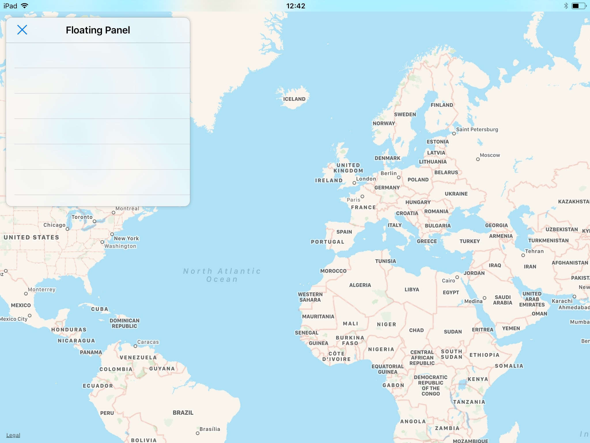

# FloatingPanel


[](https://swift.org)
[](https://www.apple.com/ios/)
[](https://twitter.com/tomn94)
[](https://opensource.org/licenses/MIT)





## Description

`FloatingPanel`, inspired by *Apple Maps* iPad app, is a small view controller which can be pinned to a corner or a side of its parent view controller.

*Any view controller can be set as the panel content.*

*Works on iPad and iPhone.*


## Installation

Just import the file `TNFloatingPanel.swift` in your project.


## Usage

Use helper methods for fast panel configuration:

```swift
/* 1. Create the panel */
let panelController = FloatingPanelController()

/* 2. Add the Panel to its parent view controller */
panelController.addTo(parent: parentViewController)
    
/* 3. Set Panel size */
panelController.resizeTo(CGSize(width:  320,
                                height: 328))
    
/* 4. Position Panel on the parent, with default margins */
panelController.pinTo(position: .topLeading)
    
/* 5. Set Panel content */
let yourContentVC = UIViewController()
panelController.setViewController(yourContentVC)
    
/* 6. Show Panel animated */
panelController.showPanel()
```

#### Blur style

You can customize the blur effect of the panel at instantiation:
```swift
FloatingPanelController(style: .extraDark)
```

#### Preset positions

You can pin the panel to any corner of its parent (`topLeading`, `bottomLeading`, `topTrailing`, `bottomTrailing`).\
Then use `resizeTo(_:)` to configure its size.

The panel can also be on a side with a full-height (`leading`, `trailing`), or full-width with (`top`, `bottom`).\
In these cases, `resizeTo(_:)` height or width will be ignored.

*You can use `left` and `right` variants to circumvent right-to-left configuration.\
Using preset positions makes sure the panel cannot be bigger than its parent, with margins.*

#### Margins

Default margins are applied between the panel and its parent.\
Use `pinTo(position:margins:)` to change them:
```swift
panelController.pinTo(position: .topLeading,
                      margins: UIEdgeInsets(top:    42, left:  21,
                                            bottom: 42, right: 21))
```

#### Animations

If you use `resizeTo(_:)` then `pinTo(position:margins:)`, the panel is hidden by default.

You can display the panel by calling: `showPanel(animated:inCornerAlongXAxis:inCornerAlongYAxis:)`\
and hide it with: `hidePanel(animated:inCornerAlongXAxis:inCornerAlongYAxis:)`

*The above optional parameters can help you configure the translation animation.*

#### Let me do

If you want to position and size the panel yourself, apply constraints to `FloatingPanelController.panelContainer`.\
If you want to populate the panel yourself, add your views to `FloatingPanelController.panel.contentView`.\
*Refer to `addTo`/`pinTo`/`resizeTo`/`setViewController` methods if needed.*

#### Example

An Xcode project demonstrating `FloatingPanel` on a map is included under [Example](Example) folder.


## Requirements

- Swift 4
- iOS 9 or later


## Release notes

#### v1.1

> Added spring animations to show/hide the panel (requires usage of helper methods to size and position the view)\
> The panel is now hidden by default.

#### v1.0
> Initial version


## Evolution

- Panel could be resizable
- Panel could be dragged from corner to corner, or freely
- Use Swift Package Manager, CocoaPods…


## Author

Written by [Thomas Naudet](https://twitter.com/tomn94), feel free to give me your feedback, or even to tell me you're using this 😃.


## Licence

Available under the MIT license.\
See the [LICENSE](LICENSE) file for more info.